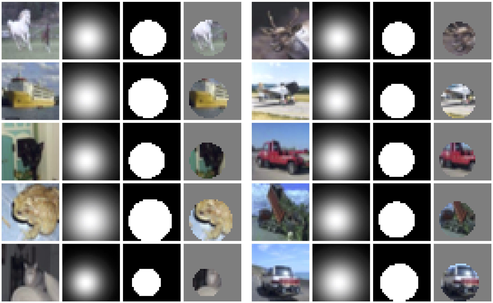

# Interpretations Steered Network Pruning via Amortized Inferred Saliency Maps - ECCV 2022

This branch contains our implementations for CIFAR-10 experiments of the paper:

> Interpretations Steered Network Pruning via Amortized Inferred Saliency Maps  
> Alireza Ganjdanesh*, Shangqian Gao*, Heng Huang  
> University of Pittsburgh  
> ECCV 2022  




## 1. Dependencies
- PyTorch + Torchvision
- PyTorch Lightning (for Data Loading)
- Numpy
- Tensorboard
- Matplotlib

## 2. Preparation
### 2.1 Description of Directories
| Path | Description
| :--- | :----------
| &nbsp;&nbsp;&nbsp;&nbsp;&nbsp;&nbsp;&nbsp;&nbsp;&nbsp;base_dir | The base directory containing all the training and evaluation files and sub-directories.
| &nbsp;&nbsp;&nbsp;&nbsp;&boxvr;&nbsp; checkpoints | Contains the trained blackbox, predictor, and selector models.
| &ensp;&ensp;&boxvr;&nbsp; dataset | Contains the dataset images and data preparation/loading codes.
| &nbsp;&nbsp;&nbsp;&nbsp;&boxvr;&nbsp; Models | Contains the codes for the models used in the AEM training stage.
| &nbsp;&nbsp;&nbsp;&nbsp;&boxur;&nbsp; results | The logs of the scripts will be saved in this directory.

### 2.2 Data Preparation
Our code automatically downloads and extracts the CIFAR-10 dataset in the `./dataset/cifar10` directory. 
You can also manually download CIFAR-10 from [here](https://www.cs.toronto.edu/~kriz/cifar.html). Please extract it in
mentioned directory.

## 3. Training the Models
### 3.1 Amortized Explanation Model (AEM) Training
To train our AEM model, at first, you need to train the `predictor` model. Then, you should use the 
trained `predictor` to train the `selector` model.

- **Predictor Training:** To train the predictor model, you can use the following commands. (All the parameters in the file are set to the default ones used in the experiments.)
    - `resnet-56`
      ```bash
      python main_train_igp_predictor.py --model_type resnet-gate
      ``` 
    - `MobileNetV2`
      ```bash
      python main_train_igp_predictor.py --model_type MobileNetV2
      ``` 
   
- **Selector Training:** After training the predictor, you should put the checkpoint in `checkpoints/resnet-56/predictor/rbf`
or `checkpoints/mobilenetv2/predictor` directories.
Then, you need to change the `line 80` or `line 84` of the `main_train_igp_selector.py` file accordingly. Finally, you can
train the model with the following commands. (All the parameters are set to the ones that we used in our experiments.)
    - `resnet-56`
      ```bash
      python main_train_igp_predictor.py --model_type resnet-gate
      ``` 
    - `MobileNetV2`
      ```bash
      python main_train_igp_predictor.py --model_type MobileNetV2
      ``` 

  Some of the important parameters are:

  | Parameter | Description
  | :---- | :----------
  | --lamda | Represents the hyperparameter λ1 in Equation 9 of the paper.
  | --smoothness_loss_coeff | Represents the hyperparameter λ2 in Equation 9 of the paper.
  | --temperature | The temperature of the Gumbel-Sigmoid distribution to sample from the predicted selector's distribution.


### 3.2 REAL-X Training
[REAL-X](http://proceedings.mlr.press/v130/jethani21a/jethani21a.pdf) has a two-stage training similar to our model. 
You can train its predictor and selector with similar steps as our model in the previous section. We describe its 
training commands for `resnet-56`.

- **Predictor Training:** To train the predictor model, you can use the following commands. (All the parameters in the file are set to the default ones used in the experiments.)
    ```bash
    python main_train_igp_predictor.py --model_type resnet-gate --selector_type real-x
    ``` 
  
- **Selector Training:** After training the predictor, you should put the checkpoint in the 
`checkpoints/resnet-56/predictor/real-x` directory. Then, you need to change the `line 88` of the 
`main_train_igp_selector.py` file accordingly. Finally, you can train the model with the following command. (All the parameters are set to the ones that we used in our experiments.)
    ```bash
    python main_train_igp_predictor.py --model_type resnet-gate --selector_type real-x
    ``` 
You can change `gpu_ids` argument in the scripts based on your available resources. Our code will automatically
train the models in the [torch.nn.DataParallel](https://pytorch.org/docs/stable/generated/torch.nn.DataParallel.html) scheme
when the number of `gpu_ids` is more than one.

We conducted all the experiments on a server with 4 Nvidia-P40 GPUs and 32 CPU cores.

## 4. Pretrained Checkpoints
We provide trained checkpoints of our AEM model on [this webpage](https://zenodo.org/record/6858456#.YtYI2tLMJhE).
The `checkpoints-CIFAR10.zip` file contains our checkpoints for our CIFAR-10 experiments. After downloading them, extract them in
the `checkpoints` directory. By doing so, the directory should have the following structure:
```
checkpoints
|_ mobilenetv2
|  |_ classifier
|  |  |_ checkpoint_iter_70380.pth
|  |_ predictor
|  |  |_ class_checkpoint_iter_44000.pth
|  |_ selector
|  |  |_ checkpoint_iter_2300.pth
|_ resnet-56
|  |_ classifier
|  |  |_ checkpoint_iter_78200.pth
|  |_ predictor
|  |  |_ rbf
|  |  |  |_ class_checkpoint_iter_105600.pth
|  |  |_ real-x
|  |  |  |_ class_checkpoint_iter_35200.pth
|  |_ selector
|  |  |_ rbf
|  |  |  |_ class_checkpoint_iter_300.pth
|  |  |_ real-x
|  |  |  |_ REAL_X_class_checkpoint_iter_300.pth
```

## 5. Visualization of the Saliency Maps
You can use the checkpoints provided in the previous section to visualize the saliency maps on the other samples of the test set of
CIFAR-10. To do so, you can use the following command:

- Our AEM Model:
  - `resnet-56`
    ```bash
    python main_visualize_selector.py --model_type resnet-gate --num_im_show 5 --selector_type rbf
    ``` 
  - `MobileNetV2`
    ```bash
    python main_visualize_selector.py --model_type MobileNetV2 --num_im_show 5 --selector_type rbf
    ``` 
- REAL-X:
  ```bash
  python main_visualize_selector.py --model_type resnet-gate --num_im_show 5 --selector_type real-x
  ```
It will save the images and their predicted saliency maps (similar to Fig 1. of the paper) in 
the output directory.

## 6. Citation
If you find this project helpful, please consider citing our paper: 
```bash
@inproceedings{ganjdanesh2022isp,  
  title={Interpretations Steered Network Pruning via Amortized Inferred Saliency Maps},
  author={Ganjdanesh, Alireza and Gao, Shangqian and Huang, Heng},
  booktitle={Proceedings of the European Conference on Computer Vision (ECCV)},
  year={2022}
  }
```

## 7. Contact
If you have any questions or suggestions, feel free to contact us. (<a>alireza.ganjdanesh@pitt.edu</a>) 
