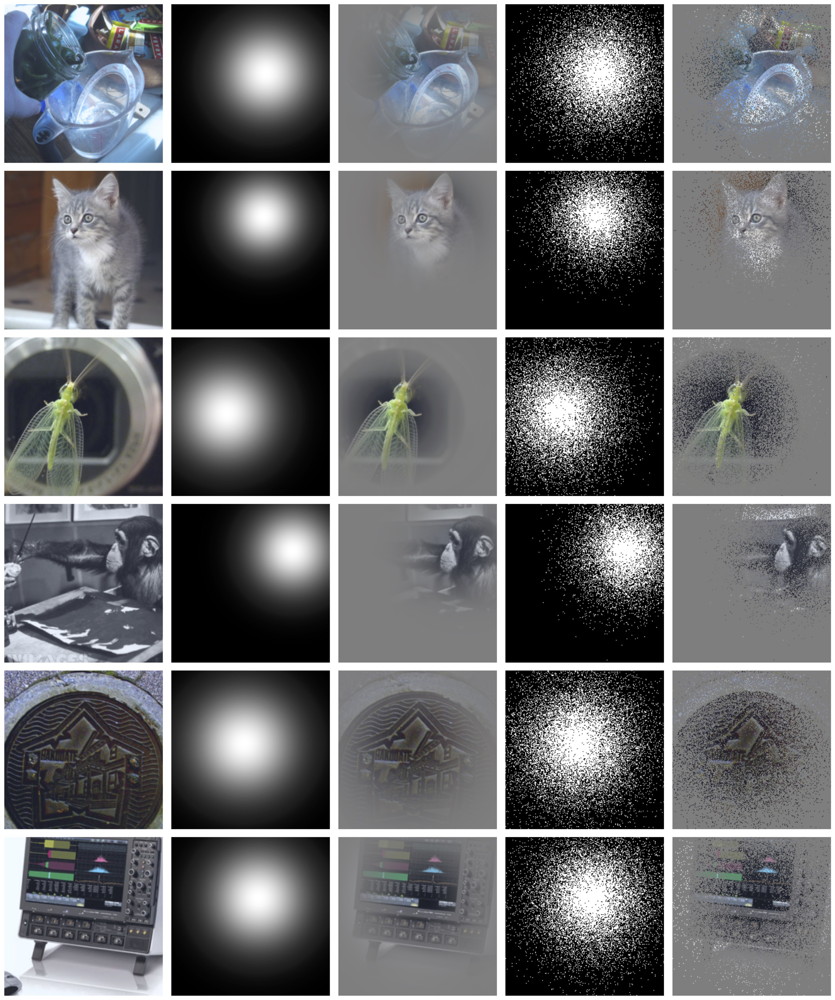

# Interpretations Steered Network Pruning via Amortized Inferred Saliency Maps - ECCV 2022

This branch contains our implementations for ImageNet experiments of the paper:

> Interpretations Steered Network Pruning via Amortized Inferred Saliency Maps  
> Alireza Ganjdanesh*, Shangqian Gao*, Heng Huang  
> University of Pittsburgh  
> ECCV 2022  



## 1. Dependencies
- PyTorch + Torchvision
- PyTorch Lightning (for Data Loading)
- Numpy
- Tensorboard
- Matplotlib

## 2. Preparation
### 2.1 Description of Directories
| Path | Description
| :--- | :----------
| &nbsp;&nbsp;&nbsp;&nbsp;&nbsp;&nbsp;&nbsp;&nbsp;&nbsp;base_dir | The base directory containing all the training and evaluation files and sub-directories.
| &nbsp;&nbsp;&nbsp;&nbsp;&boxvr;&nbsp; checkpoints | Contains the trained blackbox, predictor, and selector models.
| &ensp;&ensp;&boxvr;&nbsp; dataset | Contains the dataset images and data preparation/loading codes.
| &nbsp;&nbsp;&nbsp;&nbsp;&boxvr;&nbsp; imagenet_models | Contains the codes for the models used in the pruning stage.
| &nbsp;&nbsp;&nbsp;&nbsp;&boxvr;&nbsp; Models | Contains the codes for the models used in the AEM training stage.
| &nbsp;&nbsp;&nbsp;&nbsp;&boxur;&nbsp; results | The logs of the scripts will be saved in this directory.

### 2.2 Data Preparation
We use the subset of ImageNet for
[ImageNet Large Scale Visual Recognition Challenge (ILSVRC)](https://image-net.org/challenges/LSVRC/index.php) 
that is available on [Kaggle](https://www.kaggle.com/c/imagenet-object-localization-challenge/data?select=imagenet_object_localization_patched2019.tar.gz).
After downloading the dataset, extract it and put the `train` and `val` sub-folders of the data in the `dataset` directory.
After doing so, the directory should have a structure as follows: 
```
dataset
|_ ILSVRC2012
|  |_ train
|  |  |_ n01440764
|  |  |  |_ n01440764_9428.JPEG
|  |  |  |_ n01440764_13842.JPEG
|  |  |  |_ ...
|  |  |_ ...
|  |_ val
|  |  |_ n01440764
|  |  |  |_ ILSVRC2012_val_00011233.JPEG
|  |  |  |_ ILSVRC2012_val_00018317.JPEG
|  |  |  |_ ...
|  |  |_ ...
|_ ImageNet.py
|_ ImageNetLabels.py
```

## 3. Training the Models
### 3.1 Amortized Explanation Model (AEM) Training
To train our AEM model, at first, you need to train the `predictor` model. Then, you should use the 
trained `predictor` to train the `selector` model.

- **Predictor Training:** To train the predictor model, you can use the following command. We show an example for 
the `ResNet-50` model. (All the parameters in the file are set to the default ones used in the experiments.) 

    ```bash
    python main_train_igp_predictor.py --model_type resnet-50
    ``` 
   
- **Selector Training:** After training the predictor, you should put the checkpoint in `checkpoints/resnet-50/predictor` directory.
Then, you need to change the `line 85` of the `main_train_igp_selector.py` file accordingly. Finally, you can
train the model with the following command. (All the parameters are set to the ones that we used in our experiments.)
    ```bash
    python main_train_igp_selector.py --model_type resnet-50
    ```

  Some of the important parameters are:

  | Parameter | Description
  | :---- | :----------
  | --lamda | Represents the hyperparameter λ1 in Equation 9 of the paper.
  | --smoothness_loss_coeff | Represents the hyperparameter λ2 in Equation 9 of the paper.
  | --temperature | The temperature of the Gumbel-Sigmoid distribution to sample from the predicted selector's distribution.

We conducted all the experiments on a server with 4 Nvidia-P40 GPUs and 32 CPU cores.


## 4. Pretrained Checkpoints
We provide the checkpoints of our trained models on [this webpage](https://zenodo.org/record/6858456#.YtYI2tLMJhE).
The `checkpoints-ImageNet.zip` file contains our checkpoints for ImageNet experiments. After downloading them, extract them in
the `checkpoints` directory. By doing so, the directory should have the following structure:
```
checkpoints
|_ resnet-34
|  |_ predictor
|  |  |_ class_checkpoint_iter_55000.pth
|  |_ selector
|  |  |_ class_checkpoint_iter_1200.pth
|_ ...
```

## 5. Visualization of the Saliency Maps
You can use the checkpoints provided in the previous section to visualize the saliency maps on the other samples of the test set of
ImageNet. To do so, you can use the following command:

```bash
python main_visualize_selector.py --model_type resnet-50 --num_im_show 6
```
It will save the images and their predicted saliency maps (similar to our supplementary material's figures) in 
the output directory.

## 6. Citation
If you find this project helpful, please consider citing our paper: 
```bash
@inproceedings{ganjdanesh2022isp,  
  title={Interpretations Steered Network Pruning via Amortized Inferred Saliency Maps},
  author={Ganjdanesh, Alireza and Gao, Shangqian and Huang, Heng},
  booktitle={Proceedings of the European Conference on Computer Vision (ECCV)},
  year={2022}
  }
```

## 7. Contact
If you have any questions or suggestions, feel free to contact us. (<a>alireza.ganjdanesh@pitt.edu</a>) 