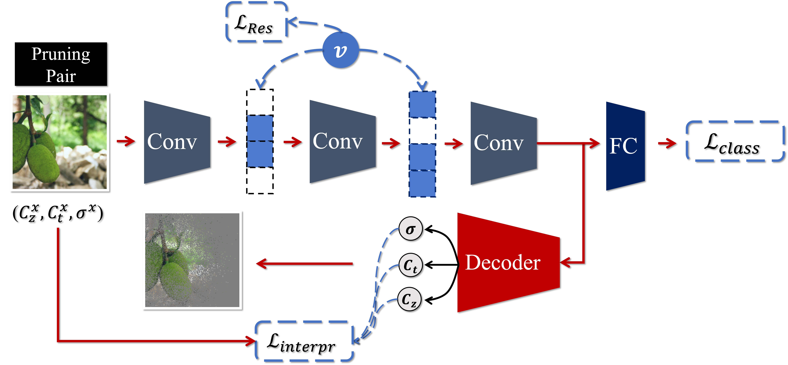

# Interpretations Steered Network Pruning via Amortized Inferred Saliency Maps - ECCV 2022

This repository contains the official PyTorch implementation for the paper:
> Interpretations Steered Network Pruning via Amortized Inferred Saliency Maps  
> Alireza Ganjdanesh*, Shangqian Gao*, Heng Huang   
> University of Pittsburgh  
> ECCV 2022



## Abstract
<a name="Abstract"></a>

<em>Convolutional Neural Networks (CNNs) compression is crucial
to deploying these models in edge devices with limited resources.
Existing channel pruning algorithms for CNNs have achieved plenty of
success on complex models. They approach the pruning problem from
various perspectives and use different metrics to guide the pruning process.
However, these metrics mainly focus on the model’s ‘outputs’ or
‘weights’ and neglect its ‘interpretations’ information. To fill in this gap,
we propose to address the channel pruning problem from a novel perspective
by leveraging the interpretations of a model to steer the pruning
process, thereby utilizing information from both inputs and outputs of
the model. However, existing interpretation methods cannot get deployed
to achieve our goal as either they are inefficient for pruning or may 
predict non-coherent explanations. We tackle this challenge by introducing a
selector model that predicts real-time smooth saliency masks for pruned
models. We parameterize the distribution of explanatory masks by 
Radial Basis Function (RBF)-like functions to incorporate geometric prior
of natural images in our selector model’s inductive bias. Thus, we can
obtain compact representations of explanations to reduce the 
computational costs of our pruning method. We leverage our selector model to
steer the network pruning by maximizing the similarity of explanatory
representations for the pruned and original models. Extensive 
experiments on CIFAR-10 and ImageNet benchmark datasets demonstrate the
efficacy of our proposed method. </em>

## Repository Structure
As our architectures and implementations for CIFAR-10 and ImageNet are different, we provide our code for CIFAR-10 
and ImageNet in two separate branches. You can access them after cloning the project with the following commands:

```bash
git checkout CIFAR10
git checkout ImageNet
```
